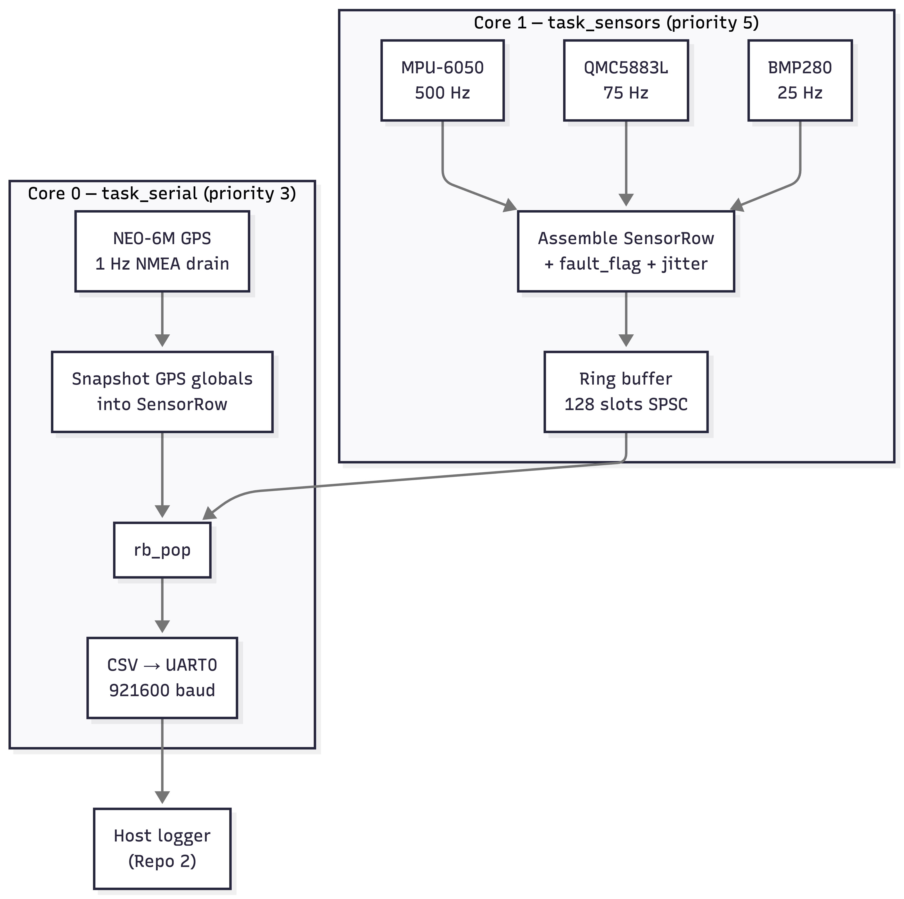
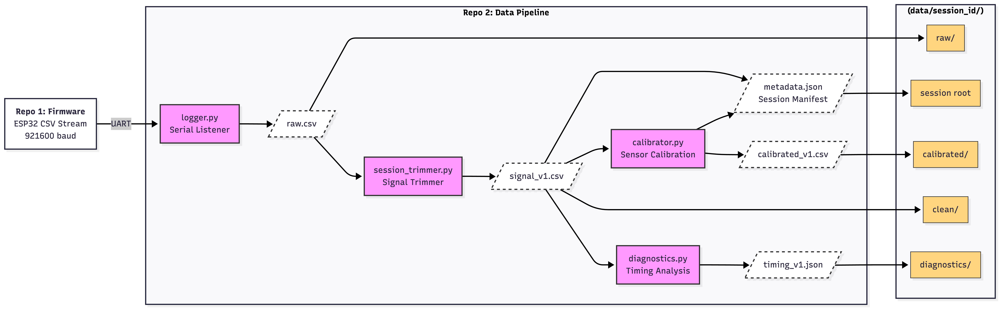
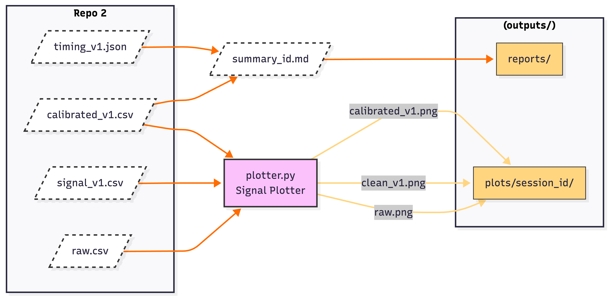
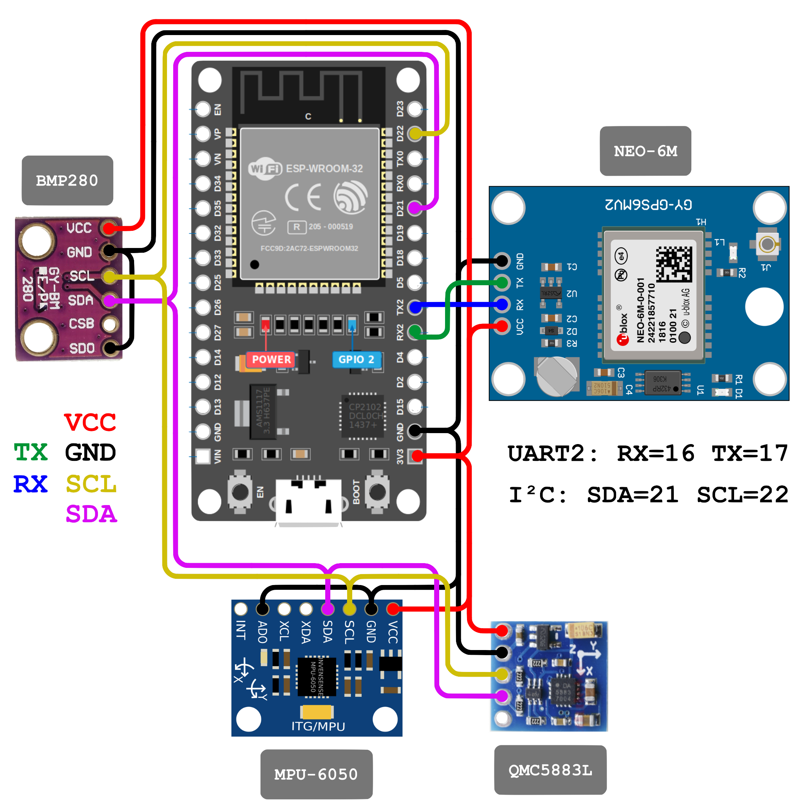
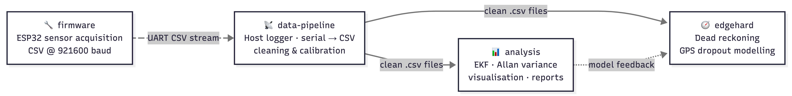

# Multi-Sensor Navigation System

> ⚠️ *The repositories of this project have been transferred to this organization from [@ShivtejG236](https://github.com/ShivtejG236).*

---

## What this is

**Repo 1** • 500 Hz deterministic multi-sensor data acquisition firmware for real-time navigation systems that fuses data streams from IMU, magnetometer, barometer and GPS into a timestamped CSV over UART at 921600 baud.

**Repo 2** • Deterministic serial logging of the sensor data, automated session trimming, robust sensor calibration pipeline and graphs & timing reports generation (for validation purposes only).

**Repo 3** • Downstream processing of the calibrated CSVs using Extended Kalman Filters & Allan variance for map visualization & diagnostic reports. Focuses on sensor error modelling, state estimation accuracy and filter convergence.

**Repo 4** • GPS dropout modelling, sensor fault injection, latency benchmarking, downsampling analysis and (later) TinyML quantization experiment & motion simulation in near-real-time using Nvidia's PhysicsNeMo model for AI surrogate generation.

---

## System Architecture

<table>
    <thead>
    	<tr>
    		<th>Repo 1</th>
    		<th>Repo 2</th>
    	</tr>
    </thead>
    <tbody>
    	<tr>
    		<td rowspan="2">
				
 <code>task_sensors</code> = producer <code>task_serial</code> = consumer

			</td>
    		<td></td>
    	</tr>
    	<tr>
    		<td></td>
    	</tr>
    </tbody>
</table>

<table>
    <thead>
    	<tr></tr>
    </thead>
    <tbody>
    	<tr></tr>
    	<tr></tr>
    </tbody>
</table>

---

## Build Details

<table style="width: 100%; border-collapse: collapse;">
  <tr>
    <!-- Center the first nested table vertically and horizontally -->
    <td style="width: 50%; vertical-align: middle; text-align: center; padding: 10px;">
      <table align="center" style="margin: 0 auto; text-align: left;">
          <tr><th colspan="3">Hardware Setup</th></tr>
          <tr><th>Component</th><th>Interface</th><th>Address</th></tr>
          <tr><td>IMU</td><td>I²C</td><td>0x68</td></tr>
          <tr><td>Magnetometer</td><td>I²C</td><td>0x0D</td></tr>
          <tr><td>Barometer</td><td>I²C</td><td>0x76</td></tr>
          <tr><td>GPS</td><td>UART2</td><td>9600 baud</td></tr>
          <tr><td>Host logger</td><td>UART0</td><td>921600 baud</td></tr>
      </table>
    </td>
    <!-- Center the sidebar image perfectly alongside both rows -->
    <td rowspan="2" style="width: 50%; vertical-align: middle; text-align: center; padding: 10px;">
      
    </td>
  </tr>
  <tr>
    <!-- Center the second nested table vertically and horizontally -->
    <td style="width: 50%; vertical-align: middle; text-align: center; padding: 10px;">
      <table align="center" style="margin: 0 auto; text-align: left;">
          <tr><th colspan="3" width="100%">Sample Rates</th></tr>
          <tr><th>Sensor</th><th>Rate</th><th>Period</th></tr>
          <tr><td>MPU-6050</td><td>500 Hz</td><td>2 000 µs</td></tr>
          <tr><td>QMC5883L</td><td>75 Hz</td><td>13 333 µs</td></tr>
          <tr><td>BMP280</td><td>25 Hz</td><td>40 000 µs</td></tr>
          <tr><td>NEO-6M</td><td>1 Hz</td><td>1 000 000 µs</td></tr>
      </table>
    </td>
  </tr>
  <tr>
    <th colspan="2" style="text-align: center; padding: 15px; vertical-align: middle;">
      All three I²C devices share the same bus at 400 kHz fast-mode 
      Lower-rate sensors are polled sub-sampled within the 500 Hz IMU loop — no separate timers, no RTOS overhead
    </th>
  </tr>
</table>

---

## Repositories Structure

<table>
    <tr>
        <th width="25%">Repo 1</th>
        <th width="25%">Repo 2</th>
        <th width="25%">Repo 3</th>
        <th width="25%">Repo 4</th>
    </tr>
    <tr>
        <td valign="top">
            <pre><code>
firmware/
├── src/
│   └── main.cpp
├── include/
│   ├── config.h
│   └── sensor_row.h
├── platformio.ini
├── sdkconfig.defaults
└── docs/
    └── setup.png
            </code></pre>
        </td>
        <td valign="top">
            <pre><code>
data-pipeline/
├── data/
├── outputs/
│   ├── plots/
│   └── reports/
├── pipeline/
│   ├── logger.py
│   ├── session_trimmer.py
│   ├── diagnostics.py
│   ├── calibrator.py
│   └── plotter.py
├── run_pipeline.py
└── README.md
            </code></pre>
        </td>
        <td>
<i>In the Making...</i>
</td>
        <td>
<i>In the Making...</i>
</td>
    </tr>
</table>

---

## Dependencies

<table>
	<thead>
		<tr>
			<th colspan="2">Firmware</th>
			<th colspan="2">Data Pipeline</th>
			<th colspan="2">Analysis</th>
			<th colspan="2">Modelling</th>
		</tr>
	</thead>
	<tbody>
		<tr>
            <th>Library</th>
			<th>Version</th>
			<th>Library</th>
			<th>Version</th>
			<th rowspan="6" colspan="2">Will be updated soon...</th>
			<th rowspan="6" colspan="2">Will be updated soon...</th>
		</tr>
        <tr>
            <td><code>Adafruit MPU6050</code></td>
            <td>2.2.6</td>
            <td><code>pyserial</code></td>
            <td>3.5</td>
        </tr>
		<tr>
			<td><code>QMC5883LCompass</code></td>
			<td>1.0.2</td>
            <td><code>pandas</code></td>
            <td>2.0</td>
		</tr>
		<tr>
			<td><code>Adafruit BMP280</code></td>
			<td>2.6.8</td>
            <td><code>numpy</code></td>
            <td>1.24</td>
		</tr>
		<tr>
			<td><code>TinyGPSPlus</code></td>
			<td>1.0.3</td>
            <td><code>matplotlib</code></td>
            <td>3.7</td>
		</tr>
		<tr>
			<td><code>Adafruit Unified Sensor</code></td>
			<td>1.1.14</td>
            <td><code>scipy</code></td>
            <td>1.10</td>
		</tr>
	</tbody>
</table>

---

## Setup

<table>
    <tr>
        <td width="50%" height="100%" padding="0">
            <table width="100%" height="100%" margin="0">
            	<tr>
                    <thead>
            		    <th>Firmware</th>
                    </thead>
                    <tbody>
                        <td> 
                			<pre><code># Build
                pio run
                            </code></pre>
                            <pre><code># Flash + open monitor
                pio run --target upload && pio device monitor --baud 921600
                			</code></pre>
                		</td>
                    </tbody>
            	</tr>
            	<tr>
                    <thead>
            		    <th>Pipeline</th>
                    </thead>
                    <tbody>
                		<td> 
                			<pre><code># Environment
                python -m venv .nav
                source .nav/bin/activate
                pip install -r requirements.txt
                			</code></pre>
                			<pre><code># Port
                /dev/cu.usbserial-XXXX on macOS (usbserial-0001)
                /dev/ttyUSBX on Linux (ttyUSB0)
                COMX on Windows (usually COM3 with no other UART devices connected)
                			</code></pre>
                			<pre><code># Execution
                python run_pipeline.py	# Interactive mode
                python run_pipeline.py --action x --session-dir data/session_XYZ --calib-mode y	# Automated mode
                			</code></pre>
                		</td>
                    </tbody>
                </tr>
            </table>
        </td>  
    </tr>
</table>

---

## Project Ecosystem

<table>
	<tr>
		<td></td>
		<td>
			<table>
				<tr><th>Repo</th><th>Status</th></tr>
				<tr><td><code><a href="https://github.com/multi-sensor-navigation-system/firmware">firmware</a></code></td><td>✅ Active</td></tr>
				<tr><td><code><a href="https://github.com/multi-sensor-navigation-system/data-pipeline">data-pipeline</a></code></td><td>✅ Active</td></tr>
				<tr><td><code><a href="#">analysis</a></code></td><td>🚧 In progress</td></tr>
				<tr><td><code><a href="#">edgehard</a></code></td><td>🔜 Planned</td></tr>
			</table>
		</td>
	</tr>
</table>
